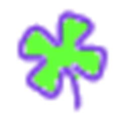

<p align="center">
  
</p>

<h1 align="center">PRGLauncher</h1>

<p align="center">
  Персональний лаунчер і трекер ігор для Steam, Nintendo Switch і Switch 2.<br>
  Менше Steam у повсякденному житті — більше контролю над власним беклогом.
</p>

<p align="center">
  <a href="https://github.com/plushenka12/PRGLauncher/releases/latest">Завантажити останню версію</a>
  ·
  <a href="https://prgtracker.netlify.app/">Веб-статистика</a>
  ·
  <a href="DOCUMENTATION.md">Детальна документація</a>
</p>

> **Поточний стабільний реліз:** [PRGLauncher 1.2.2](https://github.com/plushenka12/PRGLauncher/releases/tag/1.2.2) для Windows 10/11 x64.

## Що це таке

PRGLauncher — це не заміна магазину Steam. Steam залишається технічним бекендом для запуску та встановлення, а PRGLauncher стає твоїм основним ігровим простором: тут бібліотека, Backlog, статуси, таймери, сесії та статистика.

Застосунок поєднує ігри зі Steam, Nintendo Switch / Switch 2 і будь-які додані вручну тайтли в одному особистому каталозі. Кожен PRG Account має власні дані та персональну read-only сторінку статистики.

## Головні можливості

### Бібліотека, Backlog і статуси

- Картки ігор з обкладинками, жанрами, тегами, платформами, рейтингом і нотатками.
- Статуси **Backlog**, **Playing** і **Completed**; статус змінюється просто натисканням на бейдж картки.
- Пошук, сортування та фільтри за статусом, платформою, роком і рейтингом.
- Ручне додавання та редагування ігор, обкладинок, часу й окремих сесій.
- Початок сесії автоматично переводить Backlog-гру в Playing.
- Інтеграція з Steam-колекцією `BACKLOG`: лаунчер повідомляє лише про ігри, що були додані після першого baseline-сканування.

### Steam без зайвого Steam

- Імпорт **усієї публічної Steam-бібліотеки** за посиланням на профіль.
- Картки з назвами й обкладинками, пошук по назві або App ID, «Обрати всі» та масове додавання.
- Вибір статусу перед імпортом кожної гри.
- Кнопки Launch та Install працюють через Steam; лаунчер не просить Steam-пароль.
- Окрема вкладка **Downloads** показує реальний локальний прогрес інсталяції та розуміє скасування завантаження у Steam.
- Steam запускається тихо, коли потрібен лаунчеру; ручне відкриття Steam із трею застосунок не ховає.
- У Settings можна від’єднати Steam-профіль і підключити інший без видалення вже імпортованих ігор.

> Для профільного імпорту Steam-профіль і список ігор мають бути публічними. Деякі приватні або shared-ігри Steam API може не віддати.

### GOG Galaxy — Beta

- Локальний скан встановлених GOG-ігор через Windows registry без логіну, пароля або cookies.
- Вибір ігор картками, пошук, масове додавання та призначення статусу.
- Запуск через локальний executable або GOG Galaxy protocol.
- Історичний GOG playtime і повний акаунтовий імпорт поки не обіцяються.

### Трекінг часу й mini-bar

- Ручний таймер для будь-якої гри.
- На Windows — автоматичний старт і зупинка сесії для фактично запущеної Steam-гри.
- Історія сесій та ручне коригування тривалості.
- Плавний перехід у **mini-bar** — компактну панель у правому верхньому куті поверх усіх вікон.
- Mini-bar вміє Stand By, паузу, повернення в основне вікно та закріплення поверх інших застосунків.
- Закриття головного вікна ховає PRGLauncher у системний трей, а не завершує таймер.

### Nintendo Sync — Beta

- Read-only підключення Nintendo Account у окремому вікні OAuth.
- Імпорт Nintendo Switch і Switch 2 play activity: назва, обкладинка, платформа та час.
- Попередній перегляд списку: можна обрати ігри, задати їм статус або назавжди приховати непотрібні записи — демки, YouTube тощо.
- Delta-синхронізація: уже імпортованим іграм додається тільки новий час, без дублікатів.
- Автосинхронізація кожні 30 хвилин, якщо Nintendo-сесія активна.

> Nintendo Sync експериментальний: Nintendo не має стабільного офіційного API для Play Activity. Дані можуть з’являтися з затримкою, а точність залежить від того, що повертає Nintendo.

### PRG Account і веб-статистика

- Вхід через Email/Password або Google.
- Окрема бібліотека, налаштування й синхронізація для кожного Firebase UID.
- Власне dashboard-посилання формату `https://prgtracker.netlify.app/?u={profileId}`.
- На сайт відправляється лише read-only snapshot: статистика, платформи, топ ігор та останні сесії.
- Приватні нотатки, токени Nintendo, Steam App ID, кнопки запуску й редагований каталог на сайт не передаються.

### Інтерфейс і комфорт

- Повна українська та англійська локалізація.
- П’ять тем: **Neon**, **Ocean**, **Ember**, **Rose** і **Slate**.
- Масштаб інтерфейсу 90%, 100%, 110% або 120%.
- Контрастні картки й текст для нормальної читабельності.
- Підказки на іконкових кнопках.
- Налаштування розділені на вкладки: Загальні, Вигляд, Інтеграції та Дані.
- Автозапуск із Windows, трей-режим і автоматична перевірка оновлень.

## Встановлення

### Windows

1. Відкрий [останній GitHub Release](https://github.com/plushenka12/PRGLauncher/releases/latest).
2. Завантаж `PRGLauncher-Setup-<версія>.exe`.
3. Запусти інсталятор, залиш стандартні опції та заверши встановлення.
4. Відкрий PRGLauncher через ярлик на Desktop або в Start Menu.
5. Створи PRG Account / увійди, потім встав посилання на Steam-профіль у першому онбордингу.

Інсталятор створює ярлики, а застосунок після встановлення може запускатися тихо у треї разом із Windows. Дані користувача не видаляються під час деінсталяції.

### macOS

macOS-версія перебуває у тестуванні. Окремий universal `.dmg` збирається через GitHub Actions для тестерів; інструкція тут: [MACOS_TESTER_GUIDE.md](MACOS_TESTER_GUIDE.md).
Чекліст перевірки: [MACOS_TEST_CHECKLIST.md](MACOS_TEST_CHECKLIST.md).

Фінальний публічний macOS-реліз буде потребувати тестування на реальному Mac, Apple code signing і notarization.

## Швидкий старт

1. Увійди або створи **PRG Account**.
2. На новому акаунті встав посилання на свій публічний Steam-профіль.
3. Знайди потрібні ігри через пошук, обери їх картками та задай статус.
4. Веди сесію вручну або запусти Steam-гру через PRGLauncher.
5. Відкрий шестерню → **Nintendo Sync**, якщо хочеш додати Switch / Switch 2.
6. Перейди на персональний веб-дашборд із Settings, щоб переглянути статистику в браузері.

## Приватність і безпека

- PRGLauncher **не просить і не зберігає Steam-пароль**.
- Nintendo OAuth відбувається в окремому вікні. Nintendo session token зберігається лише локально та шифрується через Electron `safeStorage`.
- Nintendo-токени не відправляються у Firebase або на веб-дашборд.
- Steam Web API key зберігається тільки в Netlify environment variables і не має бути у репозиторії чи чатах.
- Дані PRG Account розділені за Firebase UID; веб-сторінка читає лише опублікований статистичний snapshot.

Детальніше: [SECURITY_AND_MULTIUSER.md](SECURITY_AND_MULTIUSER.md) та [NINTENDO_SYNC.md](NINTENDO_SYNC.md).

Чекліст Windows-перевірки: [WINDOWS_TEST_CHECKLIST.md](WINDOWS_TEST_CHECKLIST.md).

## Розробка

### Вимоги

- Windows 10/11 для локальної Windows-збірки.
- Node.js LTS.
- npm (встановлюється разом із Node.js).
- Steam — лише для локального відстеження, Downloads і Steam-колекцій.

### Запуск dev-версії

```powershell
npm ci
npm run dev
```

Або запусти [`run-dev.cmd`](run-dev.cmd) подвійним кліком. Dev-режим читає файли напряму з `src`, тому тестувати зміни можна без перевстановлення інсталятора.

Після змін у `src/main` або `src/preload` Electron потрібно перезапустити. Зміни лише у renderer часто достатньо побачити після оновлення вікна.

### Перевірки

```powershell
node --check src/main/index.js
node --check src/preload/index.js
node --test tests/steam-library.test.cjs
```

### Збірка

```powershell
# Windows NSIS installer
npm run build

# macOS universal DMG — запускати на Mac або через GitHub Actions
npm run build:mac
```

Готові Windows-файли з’являються у `release/`:

- `PRGLauncher-Setup-<версія>.exe` — інсталятор;
- `latest.yml` — метадані для автооновлення;
- `.blockmap` — файл диференційного оновлення.

## Структура проєкту

```text
src/main/index.js              Electron main process, Steam, tray, IPC, Nintendo OAuth
src/preload/index.js           безпечний міст renderer ↔ main
src/renderer/index.html        основний інтерфейс і логіка бібліотеки
src/renderer/mini-bar.html     floating mini-bar
web-dashboard/index.html       read-only веб-статистика
netlify/functions/             захищені серверні інтеграції, зокрема Steam library import
assets/                        іконки PRGLauncher
.github/workflows/             macOS tester build та Windows release pipeline
```

## Документація

- [Повна документація продукту](DOCUMENTATION.md)
- [Nintendo Sync: технічна документація](NINTENDO_SYNC.md)
- [Steam library import: серверне налаштування](STEAM_IMPORT_SETUP.md)
- [Захист і багатокористувацький режим](SECURITY_AND_MULTIUSER.md)
- [Roadmap](ROADMAP.md)
- [macOS release / tester docs](MACOS_RELEASE.md)
- [Changelog](CHANGELOG.md)

## Roadmap

Найближчий великий напрям — завершити macOS-версію: реальне тестування tray і mini-bar, потім Apple signing та notarization. Актуальний стан завжди є в [ROADMAP.md](ROADMAP.md).

---

PRGLauncher зроблений для людей, яким подобається бачити свій ігровий шлях, а не загубитися у вікнах магазинів, лаунчерів і нескінченному беклозі.
